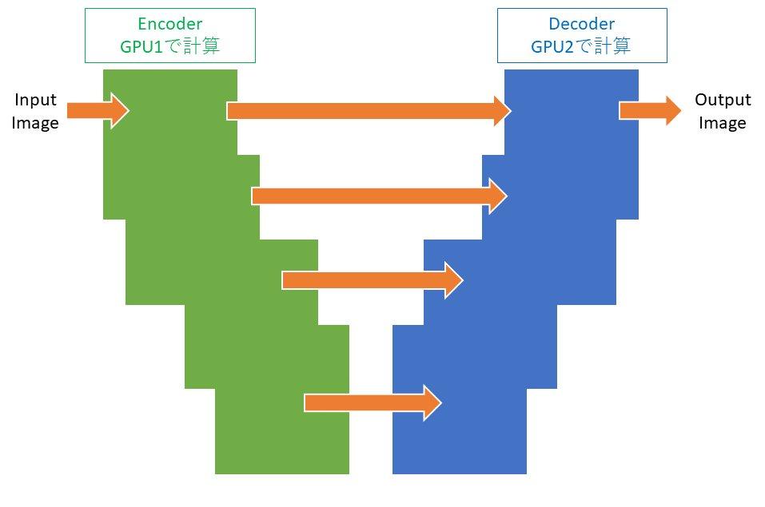

# 3D-U-Net-pytorch-model-parallel
このコードはhttps://github.com/JielongZ/3D-UNet-PyTorch-Implementation をModelParallel出来るように改変したものです。

Code is adapted from https://github.com/JielongZ/3D-UNet-PyTorch-Implementation for ModelParallel of 2 GPU.

エンコーダ部分をGPU1で計算し、デコーダ部分をGPU2で計算するようになっています。

ModelParallelによって、大きなネットワークの学習が可能です。

変更点は2つです。

１．UnetModelクラスで計算するGPUを指定して割り振り
２．EncoderBlockクラスでスキップコネクション先のtensorをGPU2に指定

参考：https://qiita.com/takeajioka/items/26439b848f66f43bb1d3

## Usage
Main.pyで画像のパスやwindow sizeなどのパラメータを調整して実行

## Dependencies
Anaconda

Python 3.6

pytorch== 1.1.0_cuda9.0.176_cudnn7.5.1_0

tifffile==2020.2.16

## Author
Takehiro Ajioka

E-mail:1790651m@stu.kobe-u.ac.jp
